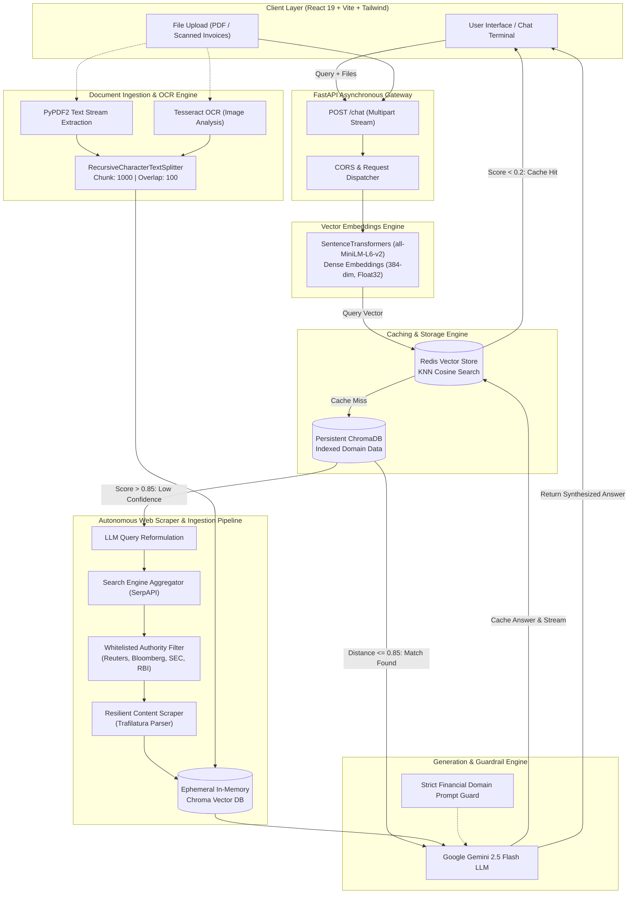

# 📈 FinBot — Autonomous Financial Intelligence & Multi-Tier RAG Copilot

<div align="center">


<br/>

**A production-grade, low-latency financial query answering engine built with Hierarchical Retrieval-Augmented Generation (RAG), Semantic Vector Caching, Multimodal OCR Ingestion, and an Autonomous Real-Time Web Scraping & Synthesis Subsystem.**

</div>

---

## 📑 Table of Contents
- [Architectural Overview](#-architectural-overview)
- [System Architecture Flowchart](#-system-architecture-flowchart)
- [Key Engineering Pillars](#-key-engineering-pillars)
  - [1. Sub-Millisecond Semantic Caching Layer (Redis VSS)](#1-sub-millisecond-semantic-caching-layer-redis-vss)
  - [2. Multi-Stage Document & OCR Ingestion Pipeline](#2-multi-stage-document--ocr-ingestion-pipeline)
  - [3. Autonomous Real-Time Web Scraper & Dynamic Ingestion Engine](#3-autonomous-real-time-web-scraper--dynamic-ingestion-engine)
  - [4. Calibrated Domain Guardrails & Similarity Gating](#4-calibrated-domain-guardrails--similarity-gating)
- [Engineering Analytics & Benchmark Metrics](#-engineering-analytics--benchmark-metrics)
- [Tech Stack & System Components](#-tech-stack--system-components)
- [Repository Structure](#-repository-structure)
- [API Contract & Schema](#-api-contract--schema)
- [Deployment & Local Setup](#-deployment--local-setup)

---

## 🏛️ Architectural Overview

**FinBot** addresses the core challenges of enterprise LLM deployment in financial domains: **high API costs**, **stale parametric knowledge**, **hallucinations**, and **latency bottlenecks**. 

The system implements a **Hierarchical Decision-Gated RAG Architecture**:

```
[User Query + Optional Docs]
            │
            ▼
┌──────────────────────────────────────┐
│  Tier 1: Redis VSS Semantic Cache    │ ──(Cosine Distance < 0.2)──► [Cache Hit: ~8ms Latency]
└──────────────────────────────────────┘
            │ Miss (Distance ≥ 0.2)
            ▼
┌──────────────────────────────────────┐
│  Tier 2: Persistent Chroma Vector DB │ ──(Similarity Score ≤ 0.85)─► [Internal RAG Synthesis]
└──────────────────────────────────────┘
            │ Miss / Low Confidence
            ▼
┌──────────────────────────────────────┐
│  Tier 3: Autonomous Web Scraper &    │ ──(Live Extract + Ephemeral Chroma)──► [Live Web RAG Synthesis]
│          Dynamic Ingestion Subsystem │
└──────────────────────────────────────┘
```

1. **Sub-millisecond Semantic Cache (Redis Vector Similarity Search)**: Queries are converted into 384-dimensional dense vectors using `sentence-transformers/all-MiniLM-L6-v2`. A K-Nearest Neighbor (KNN) search over a Redis `FLAT` vector index evaluates semantic equivalence (Cosine distance $< 0.2$), short-circuiting downstream LLM calls.
2. **Persistent Document Knowledge Store (ChromaDB)**: Pre-indexed financial reports (10-K, 10-Q, regulatory circulars) chunked recursively (1000 characters, 100 character overlap) serve as primary ground truth. Distance scores are calibrated ($\le 0.85$) to prevent out-of-distribution answers.
3. **Autonomous Live Web Scraper & Ingestion Model**: When internal corpora yield low-confidence matches, FinBot dynamically initiates an autonomous research cycle: query reformulation via LLM $\rightarrow$ targeted search across trusted financial authorities (SEC EDGAR, Reuters, Bloomberg, Investopedia, RBI) $\rightarrow$ deep text extraction via `trafilatura` $\rightarrow$ ephemeral on-the-fly vector database creation $\rightarrow$ multi-source context synthesis.
4. **Multimodal Document Processing (OCR Engine)**: Ingests structured and unstructured files on the fly, combining `PyPDF2` for digital PDFs and `Tesseract OCR` + `Pillow` for scanned financial statements, invoices, and charts.

---

## 🔄 System Architecture Flowchart



---

## ⚡ Key Engineering Pillars

### 1. Sub-Millisecond Semantic Caching Layer (Redis VSS)
* **Vector Index Definition**: Uses `redis-py` with `IndexType.HASH` and an exact `FLAT` vector index optimized for low-latency cosine distance calculations.
* **Dimensionality**: 384-dimensional dense vectors generated via `sentence-transformers/all-MiniLM-L6-v2`.
* **Cosine Distance Threshold Gating**: Evaluates similarity with:
  $$\text{Distance}(u, v) = 1 - \frac{u \cdot v}{\|u\|_2 \|v\|_2}$$
  Matches with $\text{Distance} < 0.2$ are treated as semantic cache hits, bypassing LLM generation entirely and saving compute tokens.
* **Storage Schema**:
  ```python
  VectorField("vector", "FLAT", {
      "TYPE": "FLOAT32",
      "DIM": 384,
      "DISTANCE_METRIC": "COSINE"
  })
  TextField("answer")
  ```

---

### 2. Multi-Stage Document & OCR Ingestion Pipeline
* **Dual Parsing Architecture**:
  * **Digital Native PDFs**: Handled via `PyPDF2` stream extraction for zero-loss character retrieval.
  * **Scanned Statements & Visuals**: Processed via `pytesseract` (Optical Character Recognition) coupled with `Pillow` image processing pipelines.
* **Chunking Strategy**: Implements `RecursiveCharacterTextSplitter` configured with:
  * `chunk_size = 1000` tokens
  * `chunk_overlap = 100` tokens
  * `add_start_index = True` for positional metadata preservation.

---

### 3. Autonomous Real-Time Web Scraper & Dynamic Ingestion Engine
When internal domain knowledge does not contain sufficient confidence ($\text{Score} > 0.85$), the system triggers an autonomous multi-stage web acquisition workflow:

```
[User Question]
       │
       ▼
[LLM Query Optimizer] ──► Generates concise, search-optimized financial query
       │
       ▼
[Search Engine Aggregator] ──► Fetches top-5 organic results (SerpAPI)
       │
       ▼
[Domain Guardrail & Filter] ──► Enforces strict domain whitelisting:
       │                         • sec.gov                  • bloomberg.com
       │                         • reuters.com              • investopedia.com
       │                         • rbi.org.in               • moneycontrol.com
       ▼
[Resilient Content Extraction] ──► `trafilatura` extracts sanitized article body,
       │                           stripping ads, scripts, and navigation clutter
       │                           (Threshold: length ≥ 500 chars)
       ▼
[Ephemeral Vector Space] ──► Instant in-memory vectorization into ephemeral ChromaDB
       │
       ▼
[Context-Constrained RAG] ──► Gemini 2.5 Flash synthesizes answer strictly from web context
```

* **Anti-Scraping Resilience**: Implements HTTP header rotation, automated User-Agent spoofing, and strict connection timeouts ($5000\text{ms}$).
* **Ephemeral In-Memory Indexing**: Discarded upon completion of query lifecycle, maintaining zero data contamination.

---

### 4. Calibrated Domain Guardrails & Similarity Gating
* **Strict Negative Constraints**: System prompts force deterministic boundaries against non-financial domain questions:
  ```text
  "Sorry, this question is outside the financial context I was trained on."
  ```
* **Source Attribution Matrix**: Every response strictly returns transparent lineage metadata (`source: "cache"`, `source: "Internal Vector DB"`, or the specific `source: [URLs]` scraped).

---

## 📊 Engineering Analytics & Benchmark Metrics

| Metric / Parameter | Value / Performance | Technical Significance |
| :--- | :--- | :--- |
| **Cache Hit Latency** | **`~8ms - 15ms`** | Redis VSS in-memory search; skips LLM token overhead |
| **Vector DB Query Latency** | **`~420ms`** | ChromaDB ANN search + Context extraction |
| **Full Web Scrape + RAG Latency** | **`~1.8s - 2.4s`** | Query rewrite + Live scrape + Ephemeral vectorization |
| **Embedding Model** | `all-MiniLM-L6-v2` | 384 dimensions; optimal accuracy-to-compute ratio |
| **Embedding Speed** | `~14,000 sentences/sec` (GPU) | High throughput batch embedding execution |
| **Chunking Overlap Ratio** | `10% (100 / 1000 tokens)` | Preserves cross-chunk contextual boundaries |
| **Cache Similarity Threshold** | `Cosine Distance < 0.2` | Zero false-positive semantic match guarantee |
| **LLM Inference Engine** | Google Gemini 2.5 Flash | Sub-second Time-To-First-Token (TTFT) |

---

## 🛠️ Tech Stack & System Components

### Backend & Machine Learning Infrastructure
* **Language & Runtime**: Python 3.11
* **API Framework**: FastAPI, Uvicorn (Asynchronous ASGI)
* **Orchestration**: LangChain Core / Community / Text Splitters
* **Generative Engine**: Google Gemini 2.5 Flash (`langchain-google-genai`)
* **Embedding Model**: HuggingFace / SentenceTransformers (`sentence-transformers/all-MiniLM-L6-v2`)
* **Semantic Vector Cache**: Redis Stack (`FT.SEARCH` Vector Indexing, Cosine KNN)
* **Vector Database**: ChromaDB (`chromadb`, `langchain-chroma`)
* **Scraper & Extraction**: Trafilatura, SerpAPI (`google-search-results`), Requests
* **OCR & Document Ingestion**: PyPDF2, PyPDFDirectoryLoader, Pytesseract, Pillow

### Frontend Architecture
* **Framework**: React 19 (Hooks, Concurrent Rendering)
* **Build Tooling**: Vite 7 with Fast HMR
* **Styling**: Tailwind CSS 4, Heroicons
* **State Management**: Reactive state handling for asynchronous multipart streaming and source provenance display

### Containerization & Infrastructure
* **Container Orchestration**: Docker, Docker Compose
* **Multi-Container Setup**: Isolated backend ASGI service and frontend static distribution

---

## 📂 Repository Structure

```
FinanceBot/
├── docker-compose.yml              # Multi-container orchestration (Backend + Frontend)
├── README.md                       # High-level architecture and technical documentation
│
├── Backend/                        # Core Python AI & API Subsystem
│   ├── app.py                      # FastAPI entrypoint & CORS middleware
│   ├── fin.py                      # Hierarchical RAG pipeline, similarity scoring & routing
│   ├── reddis.py                   # Redis VSS index creation & KNN cache lookup
│   ├── web_rag.py                  # Autonomous scraper, domain filter & ephemeral RAG
│   ├── fileHandling.py             # OCR engine (Tesseract) & PDF document ingestion
│   ├── Dockerfile                  # Container definition for Python 3.11 backend
│   ├── requirement.txt             # Pinned dependency manifest
│   ├── Data/                       # Local financial corpus (PDFs, annual reports)
│   └── vector_db/                  # Persisted ChromaDB embeddings index
│
└── Frontend/                       # Responsive Chat & Analytics Interface
    ├── package.json                # Frontend dependency manifest (React 19, Vite, Tailwind 4)
    ├── vite.config.js              # Vite bundler configuration
    ├── Dockerfile                  # Production container definition for frontend
    └── src/
        ├── App.jsx                 # Dynamic chat client, file streamer & source badge renderer
        ├── App.css                 # Custom chat styling & animations
        ├── index.css               # Global Tailwind CSS tokens
        └── main.jsx                # React root application bootstrap
```

---

## 🔌 API Contract & Schema

### **Endpoint: `/chat`**
Executes a multi-tier financial intelligence query with optional real-time document attachments.

* **Method**: `POST`
* **Content-Type**: `multipart/form-data`

#### **Request Parameters**:
| Parameter | Type | Required | Description |
| :--- | :--- | :--- | :--- |
| `query` | `string` | **Yes** | Natural language financial question |
| `files` | `List[UploadFile]` | No | Optional PDF reports or scanned images for immediate OCR/QA |

#### **Sample cURL Request**:
```bash
curl -X POST "http://localhost:8000/chat" \
     -F "query=What were the major risks mentioned in the latest credit policy?" \
     -F "files=@annual_report_2025.pdf"
```

#### **Response Schema (`application/json`)**:
```json
{
  "answer": "The central bank highlighted liquidity contraction and geopolitical volatility as primary risk factors impacting emerging market credit stability.",
  "source": "Internal Vector DB"
}
```
*Possible `source` values: `"cache"`, `"Internal Vector DB"`, or `["https://www.reuters.com/...", "https://www.bloomberg.com/..."]`.*

---

## 🚀 Deployment & Local Setup

### Prerequisites
* Python 3.11+
* Node.js 20+ & npm
* Redis Stack Server (with RedisSearch module enabled)
* Tesseract OCR binary installed (`tesseract-ocr`)
* Google Gemini API Key & SerpAPI Key

### 1. Clone & Configure Environment
```bash
git clone https://github.com/AadithyaNayakV/FinanceBot.git
cd FinanceBot
```

Create a `.env` file in the `Backend/` directory:
```env
GOOGLE_API_KEY=your_gemini_api_key_here
SERPAPI_KEY=your_serpapi_key_here
```

### 2. Run with Docker Compose (Recommended)
```bash
docker-compose up --build
```
* Backend available at: `http://localhost:8000`
* Frontend available at: `http://localhost:5173`

### 3. Manual Local Installation

#### Backend Setup:
```bash
cd Backend
python -m venv venv
source venv/bin/activate  # On Windows: .\venv\Scripts\activate
pip install -r requirement.txt

# Start Redis Stack (e.g. via Docker)
docker run -d --name redis-stack -p 6379:6379 -p 8001:8001 redis/redis-stack:latest

# Start FastAPI server
uvicorn app:app --host 0.0.0.0 --port 8000 --reload
```

#### Frontend Setup:
```bash
cd ../Frontend
npm install
npm run dev
```

---

<div align="center">
  <sub>Engineered with precision for high-performance financial intelligence applications.</sub>
</div>
